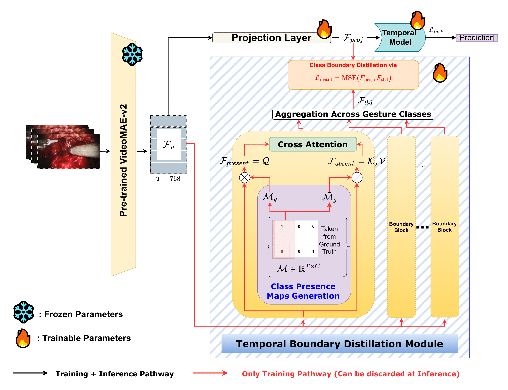

# TBDM: Temporal Boundary Distillation Module for Surgical Gesture Segmentation

<div align="center">

[]()


**Official PyTorch implementation of "TBDM: Temporal Boundary Distillation Module for Surgical Gesture Segmentation"**

**✨ Accepted at IPCAI 2026 ✨**

[Ezem Sura Ekmekci¹*](mailto:ezem-sure.ekmekci@inria.fr) · [Sebastien Frey¹²*](mailto:frey.s@chu-nice.fr) · Snehashis Majhi¹ · Khodor Hamadi¹ · Hervé Delingette¹ · Wen Wei³ · Matthieu Durand² · Pierre Berthet-Rayne³ · François Bremond¹ · Nicholas Ayache¹

¹Université Côte d'Azur, Inria · ²CHU Nice · ³Caranx Medical


</div>

---

## Highlights

- **State-of-the-art** performance on RARP-45 surgical gesture segmentation
- **Plug-and-play module** compatible with multiple temporal action segmentation architectures
- **RGB-only approach** - no kinematic data or additional sensors required
- **Minimal inference overhead** - TBDM adds only a lightweight projection layer
- **Consistent improvements** across multiple architectures and datasets (+8.5 edit score on CholecT50)

---

## Abstract

Achieving fine-grained understanding of surgical gestures remains a fundamental challenge in computer vision, due to the subtle and temporally overlapping nature of surgical motions. Gesture boundaries, where transitions between surgical actions occur, present particular challenges for precise temporal localization. 

We propose **TBDM**, a temporal boundary analysis framework that improves surgical gesture segmentation by explicitly modeling transitions between actions. Our approach operates on **RGB-only video**, without requiring kinematic data or additional annotations, and introduces **no computational overhead at inference**.

<div align="center">


**Figure:** Overview of the Temporal Boundary Distillation Module (TBDM). The module uses cross-attention between class-present and class-absent temporal regions to learn boundary-aware features during training. At inference, only the lightweight projection layer is needed.
</div>

---

## Method Overview

**TBDM** leverages privileged information during training to learn boundary-aware features through:

1. **Class Presence Maps Generation**: Binary masks identifying temporal regions where each gesture class is present/absent
2. **Cross-Attention Mechanism**: Explicitly encodes transition information between different surgical actions
3. **Knowledge Distillation**: A lightweight projection layer learns boundary-aware features supervised by both classification and distillation losses
4. **Zero Inference Cost**: At test time, TBDM is discarded - only the trained projection layer is used

**Key Innovation**: By explicitly modeling temporal boundaries during training, TBDM helps the model focus on the most challenging frames where gesture transitions occur.

---

## Results

### RARP-45 Dataset (State-of-the-Art)

| Method | Acc ↑ | Edit ↑ | F1@{10,25,50} ↑ |
|:-------|:-----:|:------:|:---------------:|
| MA-TCN | 80.9 | 79.6 | 83.7 / - / - |
| ASPNet | 82.7 | 79.8 | **86.7** / 84.0 / 74.8 |
| ASRF | 76.9 | 76.8 | 81.5 / 79.0 / 68.9|
| MS-TCN | 80.2 | 74.1 | 81.0 / 78.8 / 68.9 |
| ASFormer | 81.2 | 80.8 | 85.9 / 83.8 / 74.9 |
| MS-TCN + TBDM (Ours)| 80.1 | 74.5| 81.5 / 79.1 / 69.4  |
| ASFormer + TBDM (Ours)| **82.9** | **81.4** | **86.7 / 84.5 / 77.9** |


### CholecT50 Dataset

| Method | Acc ↑ | Edit ↑ | F1@{10,25,50} ↑ |
|:-------|:-----:|:------:|:---------------:|
| MS-TCN | 65.9 | 43.3 | 30.9 / 24.0 / 11.8 |
|MS-TCN + TBDM (ours) | **68.0** | **47.7** | **33.5 / 26.5 / 13.5** |
| ASFormer | 63.1 | 41.3 | 33.0 / 26.9 / 14.8 |
| ASFormer + TBDM (Ours)| **67.6** | **49.8** | **36.9 / 29.6 / 17.2** |
|FACT | 68.2 | 30.8 | 28.3 / 23.6 / 13.6 |
|FACT + TBDM (Ours) | **69.9** | **32.2** | **29.1 / 24.6 / 14.8** |
|Avg. Improvements | **+2.8** | **+4.4** | **+2.8 / +2.5 / +1.8** |  

**Key Observations:**
- ✅ Consistent improvements across all metrics
- ✅ Up to **+8.5 edit score** improvement on CholecT50
- ✅ Works with different architectures (ASFormer, MS-TCN, FACT)
- ✅ Particularly effective for boundary-sensitive metrics (Edit score, F1@50)

---

## Demo

<div align="center">


**Video 45 from RARP-45**: TBDM accurately localizes gesture transitions between pulling, picking-up, positioining and pushing actions.
</div>

---

## Getting Started

### Installation

```bash
# Clone the repository
git clone https://github.com/yourusername/TBDM-Surgical-Gesture-Segmentation.git
cd TBDM-Surgical-Gesture-Segmentation

# Create conda environment
conda create -n tbdm python=3.9
conda activate tbdm

# For CUDA 11.8
pip install torch==2.7.0+cu118 torchvision==0.22.0+cu118 --index-url https://download.pytorch.org/whl/cu118

# Install other requirements
pip install -r requirements.txt

```


### Code Structure

```
coming soon
```

---

## Datasets

Our method is evaluated on two surgical video datasets:

### RARP-45
- **Domain**: Robot-Assisted Radical Prostatectomy
- **Videos**: 45 surgical videos
- **Gestures**: 8 gesture classes
- **Access**: Request access

### CholecT50
- **Domain**: Laparoscopic Cholecystectomy
- **Videos**: 50 surgical videos
- **Gestures**: 10 gesture classes
- **Access**: [Request access](http://camma.u-strasbg.fr/datasets)

**Note**: Please follow the respective dataset guidelines and citation requirements when using these datasets.

---

## Training

### Training with TBDM

```bash
# Coming soon!

```

### Evaluation

```bash
# Coming soon!

```


---

## Citation

If you find this work useful for your research, please cite:

```bibtex
@inproceedings{ekmekci2026tbdm,
  title={TBDM: Temporal Boundary Distillation Module for Surgical Gesture Segmentation},
  author={Ekmekci, Ezem Sura and Frey, Sebastien and Majhi, Snehashis and Hamadi, Khodor and Delingette, Herv{\'e} and Wei, Wen and Durand, Matthieu and Berthet-Rayne, Pierre and Bremond, Fran{\c{c}}ois and Ayache, Nicholas},
  booktitle={International Conference on Information Processing in Computer-Assisted Interventions (IPCAI)},
  year={2026}
}
```

---

## Acknowledgments

This work has been supported by:
- The French government through the **3IA Côte d'Azur Investments** (ANR-23-IACL-0001)
- **GENCI** at CINES/IDRIS for computational resources on Jean Zay's V100/A100 partition (grant 2025-A0180315107)

We also acknowledge the following open-source projects:
- [MS-TCN](https://github.com/yabufarha/ms-tcn) 
- [ASFormer](https://github.com/ChinaYi/ASFormer)
- [FACT](https://github.com/ZijiaLewisLu/CVPR2024-FACT)
- The RARP-45 and CholecT50 dataset creators

---

## Contact

For questions or collaboration opportunities, please contact:

- **Ezem Sura Ekmekci**: [ezem-sure.ekmekci@inria.fr](mailto:ezem-sure.ekmekci@inria.fr)
- **Sebastien Frey**: [frey.s@chu-nice.fr](mailto:frey.s@chu-nice.fr)

---

## License

This project is licensed under the MIT License - see the [LICENSE](LICENSE) file for details.

